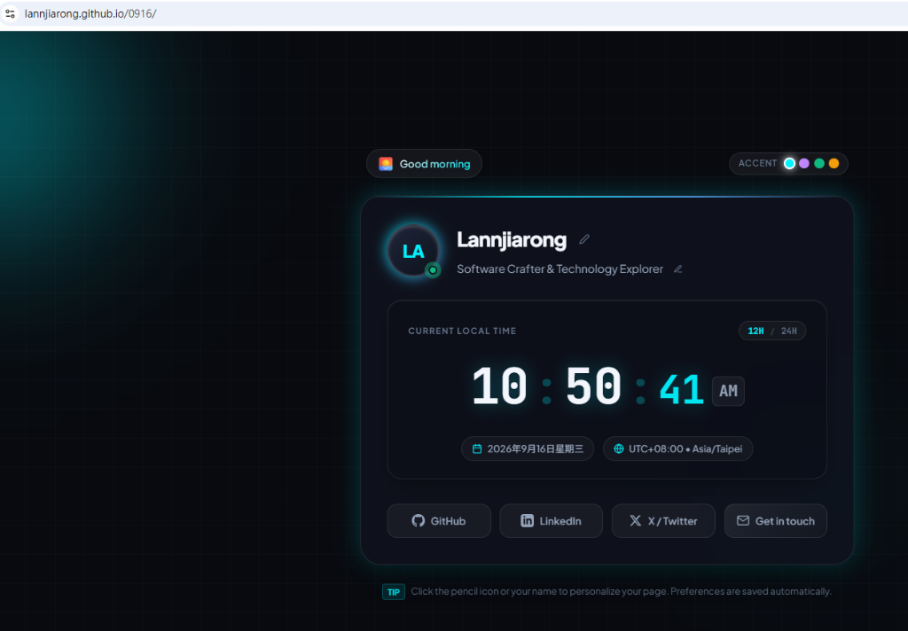
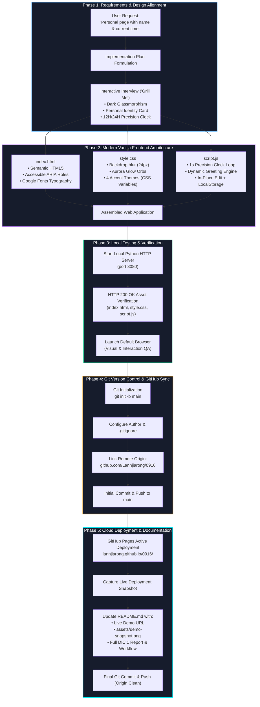

# 📋 DIC 1 (Do In Class 1): Personal Identity & Precision Live Clock

> **AuraPulse: Dynamic Personal Identity Dashboard with Real-Time Clock & Ambient Glassmorphic UI**

* **Author / Student**: Lannjiarong
* **Date**: September 16, 2026
* **GitHub Repository**: [https://github.com/Lannjiarong/0916](https://github.com/Lannjiarong/0916)
* **Live Demo (GitHub Pages)**: [https://lannjiarong.github.io/0916/](https://lannjiarong.github.io/0916/)

---

## 🔗 Live Demo & Snapshot

👉 **Access the Live Web App**: [https://lannjiarong.github.io/0916/](https://lannjiarong.github.io/0916/)



---

## 🎯 1. Project Overview & Objectives

The primary objective of this in-class assignment (**DIC 1**) was to design, construct, and deploy a personal web page from scratch using modern web standards.

The application satisfies three fundamental criteria:
1. **Personal Identity**: Features the user's name, role, avatar, and social links with interactive inline customization.
2. **Dynamic Live Time**: Integrates a real-time digital clock, time-of-day greeting engine, and local timezone detection.
3. **Modern Aesthetics**: Built with dark glassmorphism, animated ambient lighting, and zero external framework dependencies.
4. **Cloud Deployment**: Version-controlled with Git and deployed live via GitHub Pages.

---

## 🚀 2. Key Features & Implementation Details

| Feature Category | Implementation Details |
| :--- | :--- |
| **Precision Digital Clock** | • Real-time seconds continuous updating.<br>• Dual format: **12-Hour (with AM/PM)** and **24-Hour** mode toggle.<br>• Animated pulsing colon separators.<br>• Full calendar date and local timezone badge (`UTC+08:00 • Asia/Taipei`). |
| **Time-Aware Greeting** | • Dynamically detects local hour to provide context-aware greetings:<br>&nbsp;&nbsp;– 🌅 *Good morning* (05:00–11:59)<br>&nbsp;&nbsp;– ☀️ *Good afternoon* (12:00–16:59)<br>&nbsp;&nbsp;– 🌆 *Good evening* (17:00–21:59)<br>&nbsp;&nbsp;– 🌙 *Good night* (22:00–04:59) |
| **Interactive Identity Card** | • Inline click-to-edit display name and role/bio.<br>• Dynamic avatar generation computing user initials from the active name (e.g. `LJ`).<br>• Local state persistence using browser `localStorage`.<br>• Live pulsing status indicator (*Active & Online*). |
| **Aesthetic Customization** | • Dark glassmorphism (`backdrop-filter: blur(24px) saturate(160%)`).<br>• Floating ambient aurora glow orbs animated with CSS keyframes.<br>• **4 Live Accent Palettes**: Cyan Aurora, Electric Violet, Emerald Matrix, and Solar Sunset. |
| **Social & Contact Actions** | • Quick social profile links (GitHub, LinkedIn, X/Twitter).<br>• Interactive "Get in touch" button with clipboard copy feedback toast. |

---

## 🔄 3. Project Workflow



### Stage-by-Stage Breakdown:
1. **Requirements & Design Interview**: Identified core project scope, responsive card layout, and 12-hour clock specifications through an interactive Q&A alignment.
2. **Zero-Dependency Frontend Engineering**: Built semantic HTML5, token-driven CSS styling with multi-layer glassmorphism, and vanilla JavaScript for precision time tracking and local storage state persistence.
3. **Local Testing & Server QA**: Spun up a local Python HTTP server (`localhost:8080`), verified asset status codes, and validated interactive UI features.
4. **Git Version Control**: Initialized local Git repository, created `.gitignore`, linked remote repository `https://github.com/Lannjiarong/0916.git`, and pushed commits to the `main` branch.
5. **GitHub Pages Deployment & Documentation**: Hosted project publicly on GitHub Pages, captured a live verification screenshot, and thoroughly documented the full workflow and deliverables.

---

## 🛠️ 4. Tech Stack & Architecture

* **HTML5**: Semantic tags (`<main>`, `<header>`, `<section>`, `<footer>`), accessibility ARIA labels, and SEO meta tags.
* **Vanilla CSS3**: Custom CSS variables for theme switching, flexbox/grid layout, and GPU-accelerated keyframe animations.
* **Vanilla JavaScript (ES6+)**: `setInterval` time loop, `Intl.DateTimeFormat` timezone detection, and `localStorage` API for state persistence.
* **Typography**: Google Fonts (*Plus Jakarta Sans* for headings/body text, *JetBrains Mono* for digital clock digits).

---

## 📁 5. Repository File Structure

```text
0916/
├── assets/
│   └── demo-snapshot.png     # Screenshot of the live deployed page
├── index.html                # Semantic HTML structure & accessible layout
├── style.css                 # Glassmorphic styling, animations & color themes
├── script.js                 # Precision clock engine, name editor & local storage
├── README.md                 # Complete DIC 1 project report & documentation
└── .gitignore                # Git ignore rules for clean repository state
```

---

## 💻 6. Local Setup & Usage

To run this project locally:

1. **Clone the repository**:
   ```bash
   git clone https://github.com/Lannjiarong/0916.git
   cd 0916
   ```

2. **Start a local development server**:
   ```bash
   # Using Python
   python -m http.server 8080
   ```

3. **Open in browser**:
   Navigate to `http://localhost:8080/` or directly open `index.html` in any web browser.

---

## 💡 7. Key Learnings & Reflection

* **CSS Mastery**: Engineered high-end, responsive glassmorphic UI design purely with vanilla CSS, proving that external CSS frameworks are not strictly necessary for modern web interfaces.
* **Event-Driven JavaScript**: Implemented real-time DOM updates, responsive event listeners, and client-side persistence without external state management libraries.
* **Full-Stack Git Lifecycle**: Completed an authentic development lifecycle from blank workspace to live production deployment on GitHub Pages.
